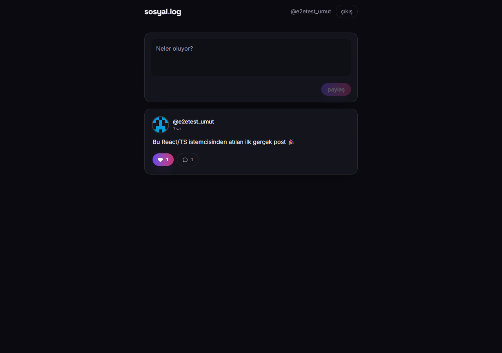
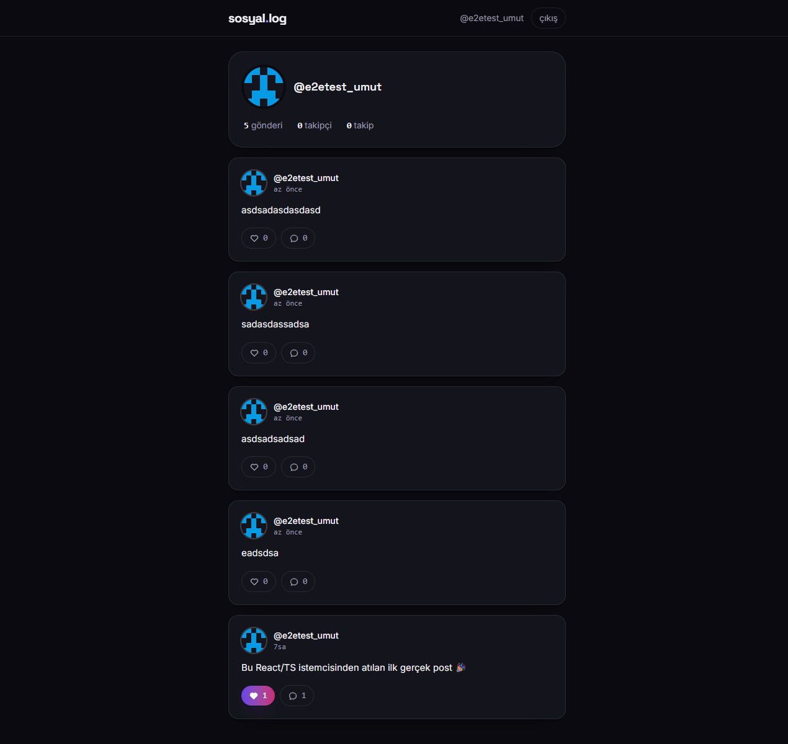
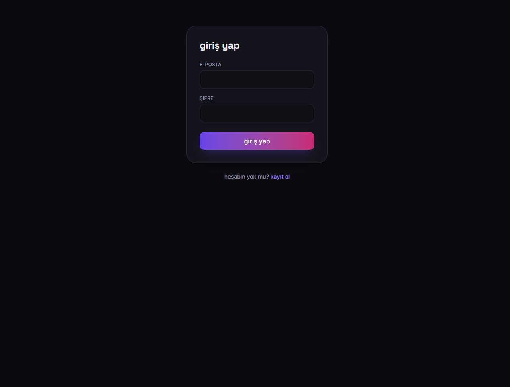

# sosyal.log

Türkçe · [English](README.en.md)

## Açıklama

sosyal.log, [Sosyal-Medya-Web](https://github.com/UmutErayAltay/Sosyal-Medya-Web) backend'inin REST API'sine bağlanan bir React + TypeScript istemcisidir. Kayıt/giriş, akış, metin gönderisi paylaşma, beğeni, yorum ve profil + takip akışlarını kapsar. Sunucu durumu baştan sona TanStack Query ile yönetilir, oturum jetonu `localStorage`'da (`smrc_auth`) saklanır ve `src/lib/api.ts` içindeki küçük `fetch` sarmalayıcısı üzerinden `Authorization` başlığı olarak gönderilir. Backend zaten yayında çalışan gerçek bir Flask/Supabase uygulaması (300+ test, aynı API'yi kullanan yerel bir Android istemcisi ile) olduğu için bu, o API'ye konuşan üçüncü ve bağımsız istemcidir: amacı bir demo görüntüsü değil, portföy iddiasının arkasına konabilecek doğrulanabilir kanıt olmak.

## Görseller







## Yığın

Vite + React 19 + TypeScript, React Router, sunucu durumu için TanStack Query, Tailwind CSS 4. Tipografi kendi barındırılan `@fontsource` paketleriyle geliyor (Space Grotesk + Inter), ikon kütüphanesi yok.

## Kapsam (v1, bilinçli olarak dar)

Kayıt/giriş, akış (liste + metin gönderisi paylaşma), beğeni, gönderi detayı ve yorum, profil görüntüleme + takip. Backend yaklaşık 100 rota daha sunuyor (mesajlaşma, hikâyeler, anketler, reel'ler, ...); bu istemci onları bilinçli olarak yüzeye çıkarmıyor — nedeni `PRODUCT.md` dosyasında.

Birkaç sınır bilinçli: beğeni ve sayılar **iyimser (optimistic)** güncellenir, yani kalp ve sayaç ağdan dönmeden çevrilir, hata olursa geri alınır. Gönderi oluşturma arayüzü yalnızca metin kabul eder (`FormData` gönderildiği için API katmanına görsel/video eklemek ileride kolay) ve `visibility` şimdilik `public`. Yorumlar iç içe yanıtları da okur, ama bu istemci yanıt yazmayı sunmaz.

## Tasarım

Görsel yön ("Afterhours" — bkz. `DESIGN.md` ve `.impeccable/surfaces/app.md`), `impeccable` tasarım skill'iyle kuruldu: açık bir SaaS varsayılanı yerine koyu öncelikli bir sosyal akış. Katmanlı neredeyse siyah yüzeyler, kendi barındırılan Space Grotesk/Inter tipografisi ve yalnızca birincil eylemler ile beğenildi durumunda kullanılan indigo→macenta gradyan vurgu. Gerçek kullanım sonrası daha açık ve soluk okunan "field notebook" yönü bunun yerini aldı; yayına girmeden önce bağımsız bir bitiş incelemesi (kontrast ölçümleri, dokunma hedefi boyutları, durum kapsamı) koşuldu.

Her hata durumu tasarlanmıştır: API hata kodları (`invalid_credentials`, `rate_limited`, `mfa_required`, ...) kullanıcıya gösterilen Türkçe mesajlara çevrilir, ham `Request failed with status code 500` sızmaz.

## Çalıştır

```bash
npm install
cp .env.example .env   # VITE_API_BASE_URL'i çalışan bir backend'e yönlendir
npm run dev
```

Varsayılan olarak `.env.example` `http://localhost:5000/api/v1` adresine işaret eder — [Sosyal-Medya-Web](https://github.com/UmutErayAltay/Sosyal-Medya-Web) backend'ini lokalde çalıştırın (`python run.py`, `.env` dosyasında `API_CORS_ORIGINS=http://localhost:5173`), ya da `VITE_API_BASE_URL`'yi canlı backend'e yönlendirin; bu durumda backend'in CORS izin listesine bu istemcinin dağıtılmış origin'ini eklemiş olmanız gerekir.

## Test

```bash
npm test        # Vitest + React Testing Library + MSW
npm run build   # tip kontrolü + production build
```

`.github/workflows/ci.yml` her PR'da ve `main` dalına push'ta Node 22 ile `npm ci` → `npm test` → `npm run build` zincirini koşar.
